# SmartDQC — Comprehensive Tool Flow

**How to render:** Go to [mermaid.live](https://mermaid.live) → clear the editor → copy from `graph LR` down to the last `class` line → paste.

```mermaid
graph LR

    classDef sharedStyle    fill:#475569,stroke:#1e293b,color:#f8fafc
    classDef mvStyle        fill:#16a34a,stroke:#14532d,color:#f0fdf4
    classDef ncStyle        fill:#ea580c,stroke:#7c2d12,color:#fff7ed
    classDef kpStyle        fill:#4f46e5,stroke:#1e1b4b,color:#eef2ff
    classDef analyticsStyle fill:#0d9488,stroke:#134e4a,color:#f0fdfa
    classDef aiStyle        fill:#7c3aed,stroke:#4c1d95,color:#faf5ff
    classDef outputStyle    fill:#d97706,stroke:#78350f,color:#fffbeb

    subgraph P0["UPLOAD AND DETECTION"]
        UPL["CSV / XLSX / XLS<br/>Multi-sheet support"]
        DET{{"Auto-detect<br/>MyVASS / NCDC / KPM / Other Source"}}
    end

    subgraph P1["COLUMN MAPPING"]
        MV_MAP["MyVASS — 12 cols<br/>ID, Jantina, Tarikh Lahir<br/>Negeri, Daerah, BIRTH_IC<br/>Tarikh Antropometri<br/>Auto-map + AI Confirm"]
        NC_MAP["NCDC — Year-prefixed cols<br/>IC_NO, Jantina, Pendapatan<br/>2023-2025 Berat/Tinggi/Tarikh<br/>Wide-to-Long preview + AI Confirm"]
        KP_MAP["KPM — School cols<br/>ID_MURID, THN_TING, Jantina<br/>Tarikh Lahir/Pengukuran, Berat, Tinggi<br/>Negeri, Daerah<br/>Auto-map + AI Confirm<br/>KKM BeratTinggi sub-dataset: column norm only"]
        UK_MAP["Other Source<br/>AI Schema Analysis<br/>No schema match — AI scans columns<br/>Infers types, builds schema dynamically<br/>User confirms or adjusts mapping"]
    end

    subgraph P2["DATA CLEANING"]
        MV_CLN["MyVASS<br/>Jantina norm — drop invalid<br/>BIRTH_IC validation (26.3% NULL ok)<br/>Date parse + sequence check<br/>Drop Age 60+ months<br/>Berat 0.5-35kg, Tinggi 30-130cm<br/>BMI recalc — drop BMI above 40"]
        NC_CLN["NCDC<br/>Wide-to-Long reshape (per year)<br/>Gender norm, income filter (Pendapatan=X)<br/>Null DOB drop, date sequence check<br/>Drop Age 60+ months<br/>Berat/Tinggi bounds, BMI recalc<br/>Duplicate MyKid — keep most recent"]
        KP_CLN["KPM<br/>Drop RAGU gender rows<br/>Duplicate ID_MURID — keep first<br/>Date parse DD/MM/YYYY, drop future dates<br/>Age 5-10 years filter<br/>Berat 12-50kg, Tinggi 100-160cm<br/>BMI calc + school categories<br/>KKM BeratTinggi: NEGERI 16-state flag<br/>KKM BeratTinggi: 2024 proxy date, 2025 drop epoch<br/>KKM BeratTinggi: duplicate ID flag + composite quality flag"]
        UK_CLN["Other Source<br/>Generic Clean<br/>Null handling and type validation<br/>Basic outlier detection<br/>No dataset-specific rules applied"]
    end

    subgraph P3["DERIVED FIELDS"]
        MV_DRV["MyVASS<br/>Age_Months, Kategori_Umur (U2/U5)<br/>WHO Z-Scores: WAZ / HAZ / BAZ<br/>Z-score classification (5 categories)<br/>Indicator flags (KBB/Bantut/Susut/Obes)<br/>Geo: Kawasan (Sabah), Bahagian (Sarawak)"]
        NC_DRV["NCDC<br/>Age_Months, year-breakdown stats<br/>WHO Z-Scores: WAZ / HAZ / BAZ<br/>Z-score classification + indicator flags<br/>Geo enrichment"]
        KP_DRV["KPM<br/>Age_Years, BMI: Kurus/Normal/Berlebihan/Obes<br/>Indicator flags<br/>Geo: Negeri, Daerah, Sekolah<br/>KKM BeratTinggi: BMI WHO 7-yr 2007 categories<br/>KKM BeratTinggi: height stunting proxy<br/>KKM BeratTinggi: multi-year combine (2024+2025)"]
    end

    subgraph P4["DATA QUALITY ASSESSMENT"]
        DQA["7-Dimension Score — Grade A to D<br/>Completeness, Validity, Consistency<br/>Uniqueness, Timeliness, Accuracy, Integrity<br/>Missing value + duplicate analysis by state"]
    end

    subgraph P5["STATISTICAL ANALYSIS AND VISUALIZATION"]
        STAT["Descriptive stats + distributions<br/>Prevalence: National / State / District<br/>Gender, income cross-cuts, yearly trends<br/>16+ chart types (histogram, boxplot, scatter, pie)"]
    end

    subgraph P6["AI AND ML LAYER"]
        CORR["Smart Data Correction<br/>Detects decimal shifts, transpositions, column swaps<br/>Classifies: entry error vs clinical vs equipment<br/>MyVASS and NCDC"]
        RISK["Predictive Risk Scoring<br/>Child-level risk from Z-scores + demographics<br/>District early warning — KKM thresholds<br/>Output: Senarai Kanak-kanak Berisiko"]
        NLQ["Natural Language Querying<br/>BM/English query to answer + chart<br/>All datasets"]
        AI_INS["AI Insight Generation<br/>Executive summary BM and English<br/>Per-indicator district narrative<br/>All datasets"]
        REC["Smart Recommendations<br/>Prioritised by impact<br/>Clinic and district guidance<br/>All datasets"]
        ENTITY["Cross-Dataset Entity Resolution<br/>Match by IC + DOB + location<br/>Unified profile: MyVASS + NCDC + KKM<br/>Detects cross-dataset contradictions"]
    end

    subgraph P7["OUTPUT AND REPORTING"]
        OUT_CLN["Cleaned Data<br/>CSV / Excel"]
        OUT_RPT["Quality Report<br/>Excel 7-9 tabs + JSON"]
        OUT_TAB["Tableau Aggregation<br/>Indicator x geo x demographic x year<br/>MyVASS and NCDC"]
        OUT_DD["Data Dictionary<br/>30+ derived fields"]
        OUT_REPORT["Automated MOH Report<br/>PDF / PPTX<br/>AI summary + charts + recommendations"]
        OUT_BENCH["Benchmarking Dashboard<br/>vs KPIs + WHO targets<br/>Traffic-light + AI trajectory narrative"]
    end

    UPL --> DET

    DET -->|MyVASS| MV_MAP
    DET -->|NCDC| NC_MAP
    DET -->|KPM| KP_MAP
    DET -->|Other Source| UK_MAP

    MV_MAP --> MV_CLN
    NC_MAP --> NC_CLN
    KP_MAP --> KP_CLN
    UK_MAP --> UK_CLN

    MV_CLN --> MV_DRV
    NC_CLN --> NC_DRV
    KP_CLN --> KP_DRV

    MV_DRV --> DQA
    NC_DRV --> DQA
    KP_DRV --> DQA
    UK_CLN --> DQA

    DQA --> STAT

    STAT -->|MyVASS and NCDC| CORR
    STAT --> RISK
    STAT --> NLQ
    STAT --> AI_INS
    CORR --> AI_INS
    AI_INS --> REC

    MV_DRV --> ENTITY
    NC_DRV --> ENTITY

    DQA --> OUT_CLN
    DQA --> OUT_RPT
    MV_DRV --> OUT_TAB
    NC_DRV --> OUT_TAB
    DQA --> OUT_DD
    REC --> OUT_REPORT
    AI_INS --> OUT_REPORT
    STAT --> OUT_BENCH
    REC --> OUT_BENCH

    class UPL,DET sharedStyle
    class MV_MAP,MV_CLN,MV_DRV mvStyle
    class NC_MAP,NC_CLN,NC_DRV ncStyle
    class KP_MAP,KP_CLN,KP_DRV kpStyle
    class DQA,STAT analyticsStyle
    class CORR,RISK,NLQ,AI_INS,REC,ENTITY,UK_MAP,UK_CLN aiStyle
    class OUT_CLN,OUT_RPT,OUT_TAB,OUT_DD,OUT_REPORT,OUT_BENCH outputStyle
```

---

## Colour Legend

| Colour | Meaning |
|--------|---------|
| **Slate** | Shared structural — Upload, Detect |
| **Green** | MyVASS path — mapping, cleaning, derived fields |
| **Orange** | NCDC path — mapping, cleaning, derived fields |
| **Indigo** | KPM path — includes KKM BeratTinggi sub-dataset |
| **Teal** | Data quality assessment and statistical analysis |
| **Purple** | AI and ML layer — corrections, risk, NLQ, insights, recommendations, entity resolution |
| **Amber** | All output and reporting nodes |

## Phase Summary

| Phase | What it shows |
|-------|--------------|
| **Upload and Detection** | Single entry — auto-detects MyVASS, NCDC, KPM; falls back to Other Source path for unrecognised schemas |
| **Column Mapping** | Per-dataset schema with actual column names; KKM BeratTinggi column normalisation only; Other Source: AI builds schema dynamically |
| **Data Cleaning** | Full per-dataset rules — no shared step; covers all business rules; Other Source: generic null handling and type validation only |
| **Derived Fields** | Age, BMI, WHO Z-scores (MyVASS/NCDC), school BMI (KPM/KKM), geo enrichment |
| **Data Quality Assessment** | 7-dimension score, 9 KKM business rules, missing/duplicate analysis |
| **Statistical Analysis** | Descriptive stats, prevalence at all geo levels, 16+ chart types |
| **AI and ML Layer** | Smart corrections, risk scoring, NL querying, AI insights, recommendations, entity resolution |
| **Output and Reporting** | Cleaned data, quality report, Tableau export, data dictionary, MOH report, benchmarking dashboard |

